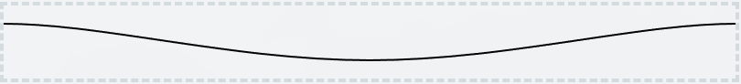
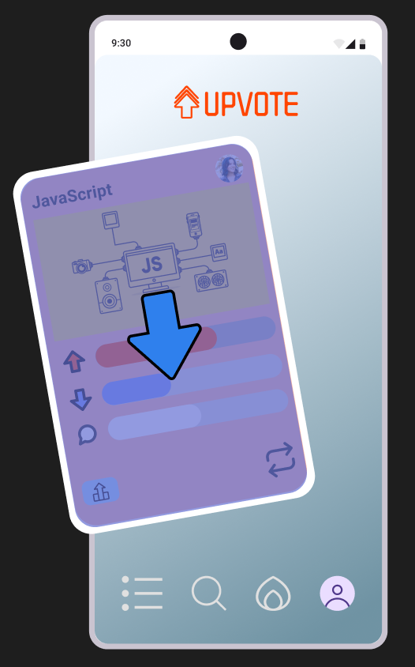
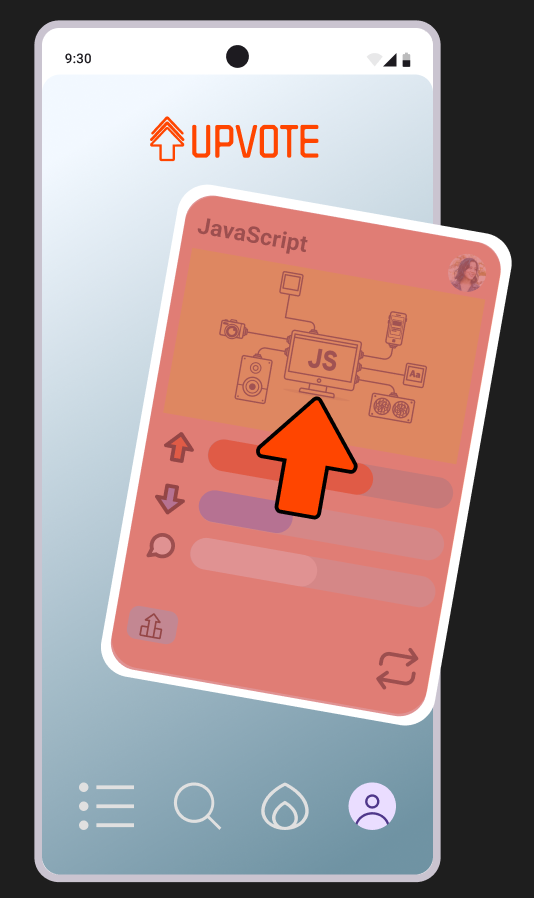

# Feature CardSwipe
## Objective
This feature is to implement the tinder like card swipe functionality to enable users to engage with the app to upvote or downvote cards.
## Background
This is the core feature of this application and is the main system that the user will interact with. It is modeled off Tinders swipe feature to indicate whether the users likes or dislikes the profile that has been served to them.
For upvote this feature will be used to upvote or downvote a post that has been served to the user. With the application tracking whether the user up-voted or down-voted the post.
## Technical Design
I will be implementing this feature through the use of CSS animation paths, to ensure that there is predictable, consistent animated path for the card when the user moves it to indicate their vote. This also opens up the opportunity for me to set of the CardUpVote and CardDownVote Redux actions based on the how far along the animation path the card is.
### Approach
For this I will set up the `@keyframes` of the animation to be off the edges of the `vw` this is so that the card can always be animated off of the screen. 
I will render cards in at `50%` of the animation so that they start at the middle of the page, if the card goes towards `0%` of the animation then it will be downvoted, if the card goes towards `100%` of the animation then it will be upvoted.
This also allows us to tie out voting buttons at the bottom of the page to trigger the animation either to `0%` or `100%`.
### Functions:
#### **[offset](https://developer.mozilla.org/en-US/docs/Web/CSS/Reference/Properties/offset)**
##### **`offset-path`**
This CSS property specifies a path for an element to follow and determines the element's positioning within the path's parent container or the SVG co-ordinates system. The path shall be designed through the `path()` function to draw a custom path that can be seen in the wire frame section.
Using two cubic bezier curves we are able to create a 'U' shaped path that the card will be able to follow along.
```css
offset-path: path("M-200,-30 C-145,-30 -75,0 0,0 C75,0 145,-30 200,-30");
```

##### **[offset-rotate](https://developer.mozilla.org/en-US/docs/Web/CSS/Reference/Properties/offset-rotate)**
Offset-rotate is used in the `@keyframes` enable the card to rotate into the direction of travel, so that it makes the user feel like they are flicking away the card. 
```css
@keyframes votepath {
	0% {
		offset-rotate: -20deg;
	}
	50% {
		offset-rotate: 0deg;
	}
	100% {
		offset-rotate: 20deg;
	}
}
```
The degrees of rotation needs to be set at the start, midpoint and end of the keyframes and the browser will calculate the amount of rotation between these points.
If we wanted to have a steeper curve to the rotation then we could also input additional `offset-rotate` properties at different points of the keyframe, but we would need to account for their persition to ensure that the rotation feels mirrored on both sided of the path.
##### **[offset-distance](https://developer.mozilla.org/en-US/docs/Web/CSS/Reference/Properties/offset-distance)**
`offset-distance` is used in two different instances for this feature. The first is to ensure that the card when not being animated is located at the middle of it's animation curve.
``` css
offset-path: path(
"M-200,-30 C-145,-30 -75,0 0,0 C75,0 145,-30 200,-30"
);

offset-distance: 50%;
```
`offset-distance` is then used in the `@keyframes` to identify the direction that the animation should go when called upon.
```css
@keyframe upvote {
	0% {
		offset-distance: 50%;
	}
	100% {
		offset-distance: 100%;
	}
}
@keyframe downvote {
	0% {
		offset-distance: 50%;
	}
	100% {
		offset-distance: 0%;
	}
}
```
#### **User Control**
What can be done to ensure that the user has control over how far they move the card, than the animation just playing.
##### Downvote & Upvote Buttons
The user should be able to activate the animations when pressing the respective upvote or down vote buttons to visually indicate their choice, and fire off the upvote/downvote dispatch to Redux.
**Implementation:**
To implement this through the upvote and downvote buttons we first had to lift an animation state to the common parent component `page.js`. In this component `[ isAnimating, setIsAnimating = useState("")` is used to set an empty string.
`isAnimating` is then passed down to the `card` component so that it can be used to set the `className` required to fire off the required animation.
`setIsAnimating` is then passed down to the `menu` component where the upvote and downvote buttons live. When either of these buttons are pressed an `onClickHandler` is fired where `setIsAnimating()` will be provided the relevant class name.
To prevent a race condition between the animation and the Redux dispatch event `setTimeout()` is used to allow the animation to run before running the dispatches. Once the dispatches have been called then `setIsAnimating` is set back to `""` so that the animation does not instantly play on the next loaded card.
**Preventing Additional Inputs:**
To prevent users from being able to click additional voting buttons during animation phase, which would result in multiple animations being activated and the card being dispatched to the upvote and downvote Redux stores. The disabled attribute is utilised to prevent users from clicking either of the buttons whilst the card is animating.
```jsx
<button onClick={onClickHander} disabled={animation != "" ? true : false}>
```
#### Dragging Card
The user should be able to use click and drag on the card to perform a upvote or downvote, like tinder swiping.
To achieve this functionality we will still track the cards movement to the `offset-path` that has been defined but calculate the distance that the user has dragged to the percentage distance along the path the user has dragged and pass it to the cards `offset-distance` attribute.
All of the following calculated elements are captured under the `currentOffset` function which is called by the `onPointerMove` property of the card. Ensure that the card is properly tracked as the user moves their pointer across the page.
**Style:**
All style updates are performed through imperative JavaScript mapping in the `cardstack__item` for the `offsetDistance` and the `offsetRotate`, with `opacity` being set in the `card` itself.
**Calculations:**
We need to be able to translate the pixels that the users has moved their cursor or finder into a percentage that can be applied to the `offset-distance` to move the card the correct distance down the `offset-path`.
Since the path is only 400px (x = -200 to x = 200):
- A delta of 0px = 50% distance
- A delta of +200px = 100% distance
- A delta of -200px = 0% distance
To calculate this distance we can use the following formula:
$$
50 + (deltX/Total Path Width * 100)
$$
Through having the result of getting the percentage of `deltax` being added to 50 we ensure that the delta percentage that we have calculated is working off the midpoint that is the cards starting position rather then from 0.
**`setPointerCapture`**
This allows the browser to track the position of the pointer even it is outside of the element that the pointer actions where defined in. This makes it so that users are still able to move the card even when their pointer leaves the bounds of the card itself.
**`releasePointerCapture`**
This tells the browser to stop tracking the position of the pointer, and is called whenever the user releases.
**`currentRotation`**
This function allows us to set the rotation of the card depending on the `currentCardDistance` that the card is along the `offset-path`. To do this we must first strip the `currentCardDistance` string of the `%` and convert it to a number.
```js
const currentCardDistance = Number(cardOffsetDistance.substring(0, cardOffsetDistance.length - 1))
```
Currently this function does not transition the card to this rotation, but rather makes it suddenly move there. Will have to see how we can transition it from one to another. Might have to be done, by adding 1 percent onto the set card offset between two ranges, every time that it is called so that we can incrementally update the cards rotation.

**Mapping the opacity and rotation to distance**
In my current implementation I am setting the `cardRotation` and `cardOpacity` based off of the last renders values for the `cardRotation` and `cardOpacity`. The better implementation would be to set this off of the current distance of the card so that I can the rotation and opacity are consistent with the distance and not linked to how fast a user might move their mouse.
**`cardRoation`**
To map the rotation of the card to it's current distance along the path we use the previously calculated `cardDistance` and use it to calculate the rotation.
```js
const cardRotation = (cardDistance / 2) - 25;
if (cardRotation < 20 && cardRoation > -20){
	setCardOffsetRoation(`${cardRotation}deg`);
}
```
We device the current `cardDistance` by 2 to reset so that we get the desired incremental steps that we would like, then we take away 25 to ensure that the middle point of the path is 0 enabling us to rotate the card in the direction of travel.
**`cardOpacity`**
The current opacity of the card should be `1` when it is at the center of the screen and `0` as it gets to of either side of the path.
To find the initial `cardOpacity` we use the following calculation:
$$
cardOpacity = cardDistance / 50
$$
This means that our initial range is `0` when the card is at `0%` along the path `1` when it is `50%` along the path, and `2` when the card is `100%` along the path.
This provides us the expected behavior when moving the card to the right but we do not want the `cardOpacity` to go over `1`. To ensure this whenever the card goes further than the distance `50` (`1` opacity) then the following calculation will be used:
$$
cardOpacity = 1 - (cardOpacity - 1);
$$
This subtracts the `cardOpacity`'s difference away from `1` ensuring that as we move from the center to the left we got from `1` to `0`.
To ensure that `cardOpacity` never goes under `0` we only `setCardOpacity` when the `currentOpacity` is equal to or above `0`.
``` js
// Calcualte card opacity
let currentOpacity = (cardDistance / 50);
// Count down from 1 to 0 if past the mid point
if(cardDistance > 50){
currentOpacity = 1 - (currentOpacity - 1);
}
if(currentOpacity >= 0){
setCardOpacity(currentOpacity);
}
```
### Wire Frames
#### **Down-vote**

#### **Up-vote**


### Original Implementation:
I originally implemented this feature through calculating the delta of the mouse from it's starting position to it's current position when the user clicked and dragged the card and then fired off the upvote or downvote Redux action depending if the user released the card into a specific zone. This came with signification performance issues with the card not rendering smoothly across the page, and could lead to unpredictable rendering behavior is a user would drag the card into zones that it was not meant to be dragged into, such as the header.